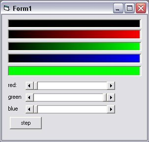



## OCX Free Progress Bar with a gradient

### Description

OCX Free Progress Bar with a gradient, I found this code on PSC and liked it so i modified it. I dont know who did the origonal code so i can not take the credit of the origonal sub.
 
### More Info
 
the percent of the bar u want the bar 2 show.

             |
---                |---
**Submitted On**   |2002-06-23 14:53:10
**By**             |[Christopher Rouse](https://github.com/Planet-Source-Code/PSCIndex/blob/master/ByAuthor/christopher-rouse.md)
**Level**          |Intermediate
**User Rating**    |4.0 (8 globes from 2 users)
**Compatibility**  |VB 3\.0, VB 4\.0 \(16\-bit\), VB 4\.0 \(32\-bit\), VB 5\.0, VB 6\.0
**Category**       |[Graphics](https://github.com/Planet-Source-Code/PSCIndex/blob/master/ByCategory/graphics__1-46.md)
**World**          |[Visual Basic](https://github.com/Planet-Source-Code/PSCIndex/blob/master/ByWorld/visual-basic.md)
**Archive File**   |[OCX\_Free\_P977856232002\.zip](https://github.com/Planet-Source-Code/christopher-rouse-ocx-free-progress-bar-with-a-gradient__1-36180/archive/master.zip)

